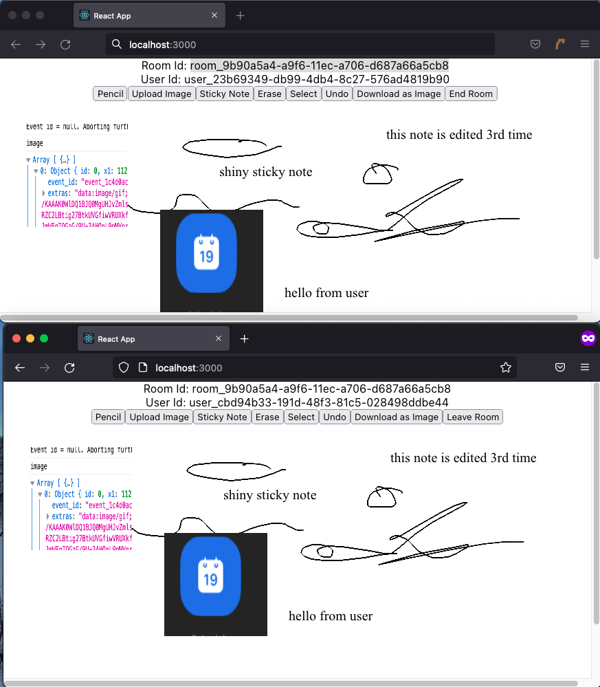

# Whiteboarding Application

This is a whiteboarding application developed by Bipin Khatiwda, Sepehr Javid, Hussam Alkhafaji for the Internet Protocol course - 2022.

## Installation
- Pull the repo
- Run `npm install` to install dependencies
- Start the server (check server guide for it)
- Ensure the configuration of server's host, IP are correctly set.
- Run `npm start`
- Check `localhost:3000`

## Important
This app uses TLS encryption. The certificate provided to the app needs to be supported by the browser as well. If it is a self-signed certificate, make sure it is added to the browser.

## Using the app
- Once the app is running, create a room and note the `room_id`.
- Open another browser instance and join the room using the `room_id`. Host needs to approve this.
- Choose different options and experiment from both user canvases.
